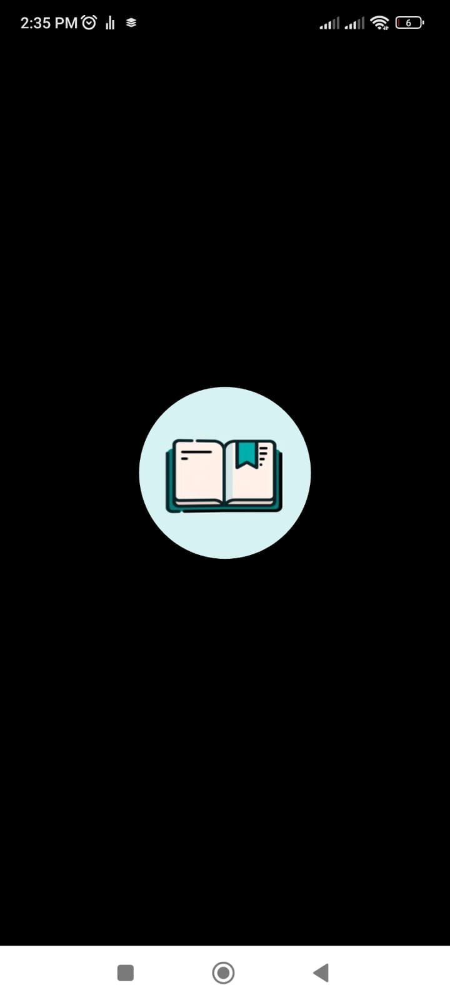
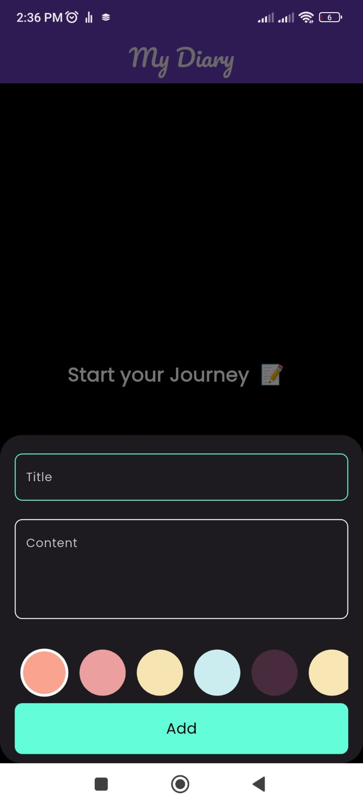
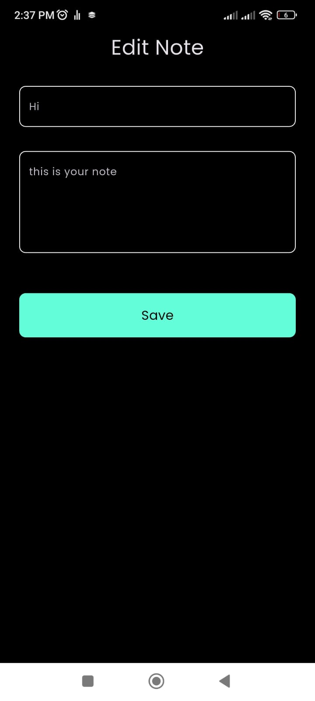
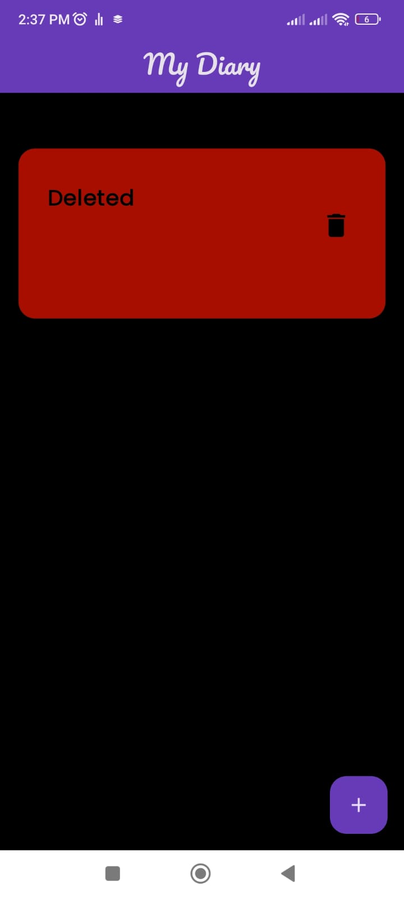

# Diary App

**Diary App** is a simple and intuitive application that allows users to create, edit, and manage their diaries. The app is designed with a user-friendly interface and offers a smooth experience for keeping personal notes or journal entries.

## Features

- **Create Diaries**: Users can create new diary entries with a title and content.
- **Edit Diaries**: Existing diary entries can be modified or updated at any time.
- **Delete Diaries**: Users can delete unwanted diaries and manage their entries.
- **Diary Overview**: View a list of all diary entries in a clear and organized manner.

## Screens

### 1. Splash Screen
The **Splash Screen** is the first screen the user encounters when opening the app. It features the app's logo and name, setting the stage for the diary experience. This screen is displayed momentarily before transitioning to the home screen.

### 2. Home Screen
The **Home Screen** serves as the main hub of the app, where users can view all their saved diary entries. Each diary entry is displayed in a card format with a title, content preview, and the creation date. Users can also:

- Tap on the "+" button to add a new diary entry.
- Scroll through their list of diaries.
- Tap the trash icon to delete an entry.

### 3. Write Diary Screen
This is where users can create a new diary entry. The screen consists of:

- **Title Field**: Enter the title of the diary entry.
- **Content Field**: Write the main content or body of the entry.
- **Add Button**: After filling in the details, users can tap this button to save their new diary.

### 4. Edit Diary Screen
On this screen, users can update the details of an existing diary entry. The screen consists of:

- **Title Field**: Pre-filled with the title of the existing entry, which can be modified.
- **Content Field**: Pre-filled with the content of the existing entry for editing.
- **Save Button**: Once the updates are made, tapping this button will save the changes.

### 5. Deleted Diary Screen
When a user deletes a diary, the entry is removed from the main list on the home screen, the deleted diary simply gets removed.

## How to Use

1. **Start Your Journey**: Begin by opening the app. The splash screen will appear for a brief moment, followed by the home screen where all diaries are displayed.
2. **Creating a Diary**: Tap the "+" button on the home screen to open the "Write Diary" screen. Fill in the title and content, then tap "Add" to save your entry.
3. **Editing a Diary**: To modify a diary entry, tap on it from the home screen. This will take you to the "Edit" screen. After making changes, tap "Save" to update your diary.
4. **Deleting a Diary**: To delete a diary, tap the trash icon next to the respective entry on the home screen.

## Technologies Used

- **Front-end**: Developed using Flutter.
- **Back-end**: Saving data using Hive.
